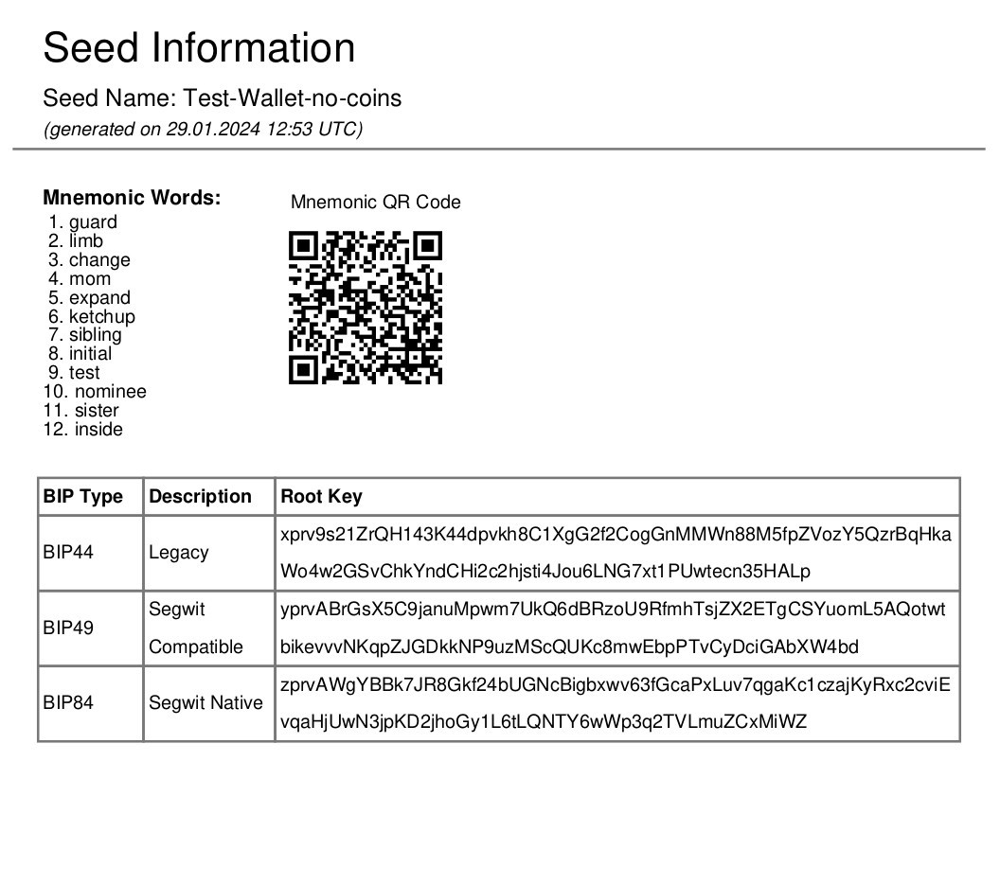

# Bitcoin Wallet Seed and Key Generator (bip39)

## Overview
This repository contains two Python scripts for generating and managing cryptocurrency wallet seeds and keys in compliance with BIP39, BIP44, BIP49, and BIP84 standards. These scripts facilitate the creation of mnemonic phrases, derivation of wallet keys, and generation of QR codes and PDFs for secure and convenient storage of wallet information.
This repository now includes an additional Bash script for generating Bitcoin addresses and keys. The script creates a temporary Python environment, generates standard and BIP44, BIP49, BIP84 compliant Bitcoin addresses and keys, and presents them in a user-friendly format.

### Scripts
1. **bip39-wallet-gen-QR-codes-markup.py**: Generates mnemonic phrases and derives wallet keys, embedding this information along with **QR codes** into a text file with **markup formatting**.
   
2. **bip39-wallet-gen-PDF.py**: Similar to the first script but outputs the wallet information, including QR codes, in a **well-formatted PDF document**.
3. **generate_BTC_address-all_locally.sh**: This Bash script leverages Python to generate Bitcoin addresses and keys. It presents the results with ASCII art for clarity and aesthetics.

## Features
- **Mnemonic Phrase Generation**: Both scripts generate mnemonic phrases of 12 or 24 words.
- **Key Derivation**: Implements BIP39, BIP44, BIP49, and BIP84 standards for key derivation.
- **QR Code Generation**: Creates QR codes for mnemonic phrases, wallet keys, and addresses.
- **Output Formats**:
  - **Markup File**: The first script generates a text file with markup, including QR codes embedded as base64 images.
  - **PDF Document**: The second script creates a PDF document with all relevant wallet information and QR codes.
- **Isolated Python Environment**: Generates keys in a temporary Python environment for security.
   - **Support for Multiple BIP Standards**: Handles BIP44, BIP49, and BIP84 Bitcoin address and key generation.
   - **Formatted Output**: Utilizes ASCII art to present the Bitcoin address and keys in an easy-to-read format.

## Prerequisites
- Python 3.x
- Required Python libraries: `mnemonic`, `bip_utils`, `qrcode`, `base64`, `io`, and `fpdf` for PDF generation.

## Installation

1. Clone the repository:
`git clone https://github.com/MCM-Mike/bitcoin-bip39-wallet`
2. Install the required Python libraries: `pip install mnemonic bip-utils qrcode Pillow base64 fpdf`
   
## Usage
1. Run the desired script: `python bip39-wallet-gen-QR-codes-markup.py`
or `python bip39-wallet-gen-PDF.py`

2. Follow the on-screen prompts to generate your mnemonic phrase and choose the seed name (optional).
3. The output will be saved in the same directory as the script.

## Examples

- **Screenshots**: 
- **Sample Outputs**: [View Test Wallet Markup Example](https://github.com/MCM-Mike/bitcoin-bip39-wallet/blob/main/examples)

## Entropy and Security
All scripts in this repository use a cryptographically secure random number generator to create the mnemonic phrase. Users can choose between a 12-word (128 bits of entropy) or 24-word (256 bits of entropy) mnemonic, both of which are considered secure industry standards.

### Disclaimer
**Security Warning:** Generating a wallet on a machine that may be compromised (e.g., infected with malware or viruses) is highly risky. For storing significant value, it is strongly recommended to generate your wallet on a clean, offline computer to minimize the risk of your private keys being stolen.

## Contributing
Contributions to this project are welcome. Please fork the repository and submit a pull request with your proposed changes.

## Acknowledgements

This project makes use of the Python programming language and implements Bitcoin Improvement Proposals (BIPs). We acknowledge the use of external libraries compliant with their respective licenses. The BIP specifications utilized in this project can be found in the [Bitcoin BIPs repository](https://github.com/bitcoin/bips/tree/master?tab=readme-ov-file).

## License
This project is licensed under the MIT License - see the [LICENSE.md](LICENSE.md) file for details.

